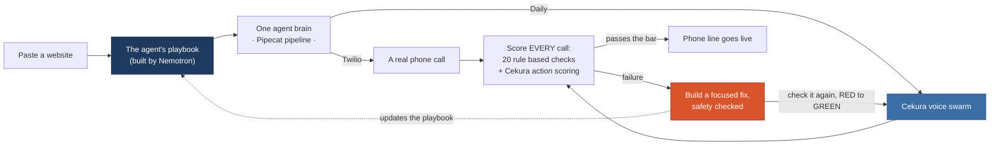
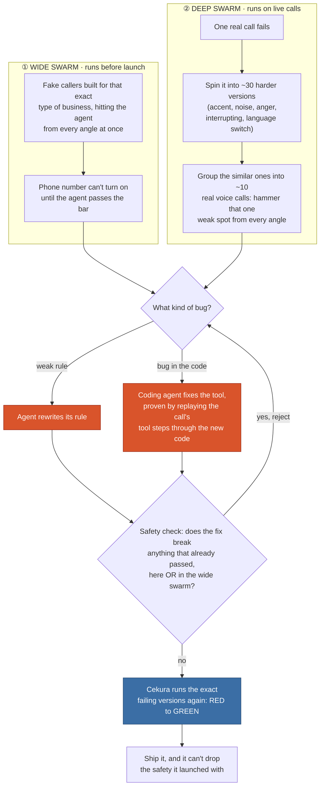
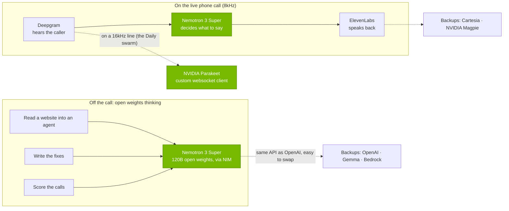

# Otto

**Paste a business website. Get a working phone line that fixes itself, in 30 seconds.**

> We're not selling a voice agent. We're selling **confidence that a business can safely let
> AI answer the phone.** The hosts said it best: *"we're not looking for the best sounding
> voice. We're looking for the best **system**."* Otto is the system.

Built at the **Voice Agents Hackathon** (YC SF, May 30 2026), hosted by **Daily** and
**Cekura** with **NVIDIA**, **AWS**, and **Twilio**. It runs the full four part brief: Build and
Customize, Deploy at Scale, Simulate and Evaluate, and **Auto-Improve**. That last stage, where
the test results flow back in and make the agent safer, is the actual product.

---

## 1. What is this?

**Otto turns a business's website into a phone agent that gets stress tested before it ever
rings, and keeps fixing itself after it does.** Paste a URL. Otto reads the site and builds the
agent: its greeting, what it knows, what it's allowed to *do* (book a table, check availability,
take a payment, hand off to a human), and the rules it has to follow. Then, before that number
goes anywhere near a customer, a swarm of fake callers attacks it. It goes live only when it can
prove it's safe, and every real call after that gets scored too.

```
BEFORE LAUNCH   read the site → build the agent → fake callers attack it → it fails → it fixes itself → runs again → passes the bar → goes live
LIVE            every real call → scored → a failure builds its own fix → a focused swarm checks it again (RED to GREEN) → ships
```

**The failure everyone else misses: a call that sounds perfect and never books the table.**
Warm, fast, natural, and then the customer shows up to no reservation. The transcript reads
fine; nobody booked anything. Most testing grades the *words*. Otto grades what the agent
actually *did*. It reads each call as a stream of events across four things: what it **said**,
what it **did**, how the call **ended**, and how it **felt** to the caller, using 20 checks that
mostly run on fixed rules. Every failure it finds builds its own fix. (See
[`docs/FAILURE_TAXONOMY.md`](docs/FAILURE_TAXONOMY.md).)

**Why it's worth building.** For a local business the phone is the front door, not a support
line. Nearly 8 in 10 people say a call matters when they need to reach a business, and 55% reach
for the phone first when it's urgent (TransUnion, 2024).[^transunion] Those calls are worth more
than anything else: across 60M+ calls, 37% of phone leads close right there on the line, versus
under 2% for a web form (Invoca, 2025).[^invoca25] But nobody's there to pick up. Restaurants
are short staffed, with 45% saying they don't have enough people to meet demand (NRA,
2024),[^nra] so the phone rings while the team is buried. About a quarter of calls to home
services businesses go unanswered, and almost nobody who lands in voicemail leaves a message
(Invoca, 2024).[^invoca24] A missed call isn't a callback later. It's a customer who already
dialed someone else, and 1 in 3 businesses say they've lost money simply because they couldn't
get to the phone (Hiya, 2025).[^hiya]

So why not just hand the phone to an AI? Because for these businesses a wrong answer is worse
than a missed one, and AI fails in the exact way that scares them: it says the wrong thing with
total confidence. Speech to text invents words that were never spoken in about 1% of transcripts,
and roughly 40% of those made up words are actively harmful (ACM FAccT, 2024).[^whisper] Models
quietly get worse over time in 91% of cases (Nature, 2022).[^aging] And about 95% of company AI
projects show no real impact on the bottom line (MIT, 2025).[^mit] The hard part was never making
the voice sound good. It's earning enough trust to turn it on, and that's only possible when the
job is small enough to test every way it can go wrong. One restaurant's phone calls are exactly
that small. That's the bet Otto makes.

---

## 2. Demo video (under 60 seconds)

▶️ **[watch the 60 second demo](ADD_VIDEO_LINK_HERE)**

> *Build a phone agent from a URL. A swarm of fake callers attacks it and it goes red. It
> rewrites its own rules and the pass rate jumps to green. The number goes live. We call it and
> ask the exact thing it failed a minute ago, and now it handles it. Loop closed, on camera.*

---

## 3. How we used Cekura, Nemotron, and Pipecat

**One agent brain, built from the playbook, reached two ways through a single Pipecat pipeline: a
real phone call over Twilio, and a swarm of fake callers over Daily. So the thing we *test* is the
exact same thing that *answers the phone*. Every call, fake or real, gets scored as a stream of
events, and any failure spins up a focused swarm that reproduces it, builds a fix, and can't ship
until the fix is proven not to break anything that already worked.**



### Cekura: two swarms, opposite shapes, one fixing engine

We don't run one round of testing. We run two swarms built for opposite jobs, and that contrast
is the whole idea.

**The first swarm goes wide, and it runs before the agent goes live.** It's a set of fake callers
built for that exact kind of business: allergy questions and large party bookings for a
restaurant, emergency calls and licensing traps for a contractor. They hit the new agent from
every angle at once, and the phone number can't turn on until the agent passes a set bar. The
point here is coverage. Find every weak spot before a real customer ever calls.

**The second swarm goes deep, and it runs on live calls.** Every real call is scored the moment it
ends, across 20 plain checks that run on fixed rules and look at what the agent said, what it did,
how the call ended, and how it felt to the caller. When a call fails, we choose on purpose not to
just patch that one call. Fixing off a single call teaches the agent the exact words that broke it
and nothing else. Instead we take that one failure and spin it into about 30 harder versions of
the same call: the same request but with a thick accent, with background noise, from an angry
caller, from someone who keeps interrupting, from someone who switches language partway through.
Now the fix has to hold up against the whole family of that failure, not the single call that
exposed it. One bad call becomes a tight test set aimed straight at that weak spot.

Running all 30 as real voice calls would be slow and costly, so the deep swarm groups them. Many
of those 30 versions are really the same type of difficulty, so they can share one real voice
call. That folds about 30 versions down to about 10 real calls that still cover the full range
(`cekura.py:69-82`, proven in `test_loop.py:882`). This is the trick that lets the deep testing
run on real audio instead of faking it with text, and still stay fast enough to watch live.

**How a live fix actually happens.** First we sort the failure by what kind of bug it is. If it's
a missing or weak rule, the agent rewrites its own rule. If it's a bug in the tool code that no
rule could ever fix, like a booking tool that can double book, a tool that sometimes never
replies, or a path that could write a card number into a record, then a coding agent writes a real
code change and proves it by replaying that exact call's tool steps through the fixed code and
running the same checks again. Two kinds of fixes, one scoring system. Either fix then has to pass
a safety check: it ships only if it breaks nothing that was already passing, so the agent can only
get better, never worse, by design. And that same check runs against the wide swarm from before
launch too, so fixing a rare live case can never quietly undo the safety the agent shipped with.
That last guarantee is the part most demos that claim an agent fixes itself quietly skip.

Both swarms run through one switch. A single setting picks the engine under them: the real Cekura
voice swarm over a Daily room, or a fast local version, and if a key is missing it falls back on
its own so the loop always runs (`swarm.py:54-77`). The same checks score all of it. And Cekura
scores actions, not just words: whether the agent called the right tools and whether the booking
actually landed, not whether the transcript sounded nice. That's how the system catches the call
that sounds perfect and never booked the table.



> **What we were testing, and how much it improved.** In one fixing round, with nothing hand fed,
> the restaurant agent went from 50% to 100% (6 of 12 tough callers passing, then all 12), and the
> contractor went from 62% to 100% on its own failures. It couldn't game its way there: the safety
> check threw out the one proposed fix that would have broken an allergy test that was already
> passing. Honest scope: those numbers come from the fast local mode (`SWARM_MODE=local`), the same
> loop Cekura drives in `SWARM_MODE=cekura`, run through the same path.

### Nemotron (NVIDIA): open weights doing the real work

The brief asked for open weights models doing real thinking, not just speech, so that's where we
put Nemotron, and it's the brain on every part of the system. Off the call it reads a messy website
into a clean playbook, writes the fixes, and judges how each call went. On the call it's the brain
that decides what to say, live, in real time. The model is **Nemotron 3 Super, a 120B open weights
model**, served through NVIDIA's NIM, and an open weights model that size holding a natural phone
conversation is the "voice" and "open weights" themes in one shot. Because NIM speaks the same API
as OpenAI, pointing our entire thinking layer at it was a one line change.

We also built a **custom listener for NVIDIA Parakeet**, and the engineering there is real even
though it isn't what hears the phone. The hackathon Parakeet service talks over a raw websocket
that no built in Pipecat piece knows how to speak, so we wrote our own client (`nvidia_stt.py`)
with three details that matter on a live call:

- **It handles pile up transcripts the right way.** The service sends each draft as the full
  sentence so far, so one turn's words bleed into the next. We cut the already finished words by
  counting them, not by matching the text, which keeps working even when the service quietly
  changes how a word is spelled partway through.
- **It ends a turn on a clear signal, not a timer.** When the caller stops talking, we send a hard
  reset that grabs the last few words and ends the turn right away, instead of waiting on a silence
  timer. Faster back and forth, and cleaner turn taking.
- **It never clips the first word.** We keep a one second rolling buffer of audio so the start of a
  sentence isn't cut off, and we keep every "uh" and "hold on," because that hesitation is a real
  signal the call quality checks read, not noise to clean up.

Here's the honest catch, and it's a useful one: Parakeet needs 16kHz audio, and a normal phone line
is 8kHz. So on the actual phone call we let Deepgram do the listening, because it's built for 8kHz
phone audio, and we run Parakeet on the higher quality 16kHz line that the Cekura swarm uses.
Knowing that 8kHz versus 16kHz difference is the line between a call that transcribes and one that
silently hears nothing. The voice you hear back is ElevenLabs, with Cartesia and NVIDIA Magpie as
one setting backups. So the live phone stack is a Nemotron brain, Deepgram ears, and an ElevenLabs
voice, with the full NVIDIA path (Parakeet plus Magpie) ready on any 16kHz line. One free `nvapi-`
key runs all the NVIDIA parts.



### Pipecat: why "tested" and "live" are the same thing

The agent's brain is built once from the playbook, and Pipecat lets us reach it two ways: a real
call comes in over Twilio, the fake caller swarm comes in over a Daily room, and both run through
the exact same pipeline. That one fact is the whole trick. It means a fix the swarm proves out is
*literally* the code that answers the phone, not a close copy of it. We lean on Pipecat for the
swappable call types, the tool calling that powers the agent's actions, and the turn taking and
interruption handling that make the "interrupter" caller a real test instead of a script. There's
also an AWS Nova Sonic speech to speech path in there as an option, instead of the usual listen,
think, speak chain. (See [`docs/TECH.md`](docs/TECH.md).)

---

## 4. What we built during the hackathon

All of it. The repo's first commit is 9:04am on May 30 (it started life as "LineForge" and got
renamed to Otto a couple hours in), and everything below was written that day:

- the playbook format and the website to agent reader (it crawls the whole site plus reads the
  page's structured data);
- the self fixing loop itself: the swarm, the failure detection, the rule writing, the safety
  check that makes every fix provably safe, and the launch bar;
- the failure checks: the four part, 20 check engine that reads a whole call as a stream of events
  (including voice and tone signals) and catches the sounds great but did nothing failures a
  transcript would miss;
- the live loop, where a single real failure spins up a batch of focused variations (different
  accents, background noise, an angry caller) to confirm and harden the fix;
- the coding agent that fixes bugs living in the code instead of the rules;
- the live Pipecat voice agent (Nemotron brain, with Nova Sonic, Deepgram, Cartesia, and ElevenLabs
  options), the Cekura client, six business types, a real backend that tracks inventory and catches
  double bookings, live Twilio texts, the streaming dashboard, a printable safety certificate,
  deploy paths for Render, Pipecat Cloud, and AWS AgentCore, and a 50 test suite that passes with no
  keys at all.

What we *didn't* build is the plumbing underneath. Pipecat, Cekura, the NVIDIA models on NIM, and
Twilio are all theirs, and the Parakeet listener is taken straight from the hackathon starter (we
just added a small piece to bridge a Pipecat version gap). Daily and NVIDIA's Nemotron voice stack
was our starting point.

---

## 5. Feedback on the tools

> *Note to the team: this is drafted from how the build actually went. Tighten it to your own
> experience and drop in any real bugs you hit. Cekura asked about bugs, and there's a prize for
> the best feedback.*

**NVIDIA Nemotron.** The best part was how little friction there was. Because NIM speaks the same
API as OpenAI, pointing our whole thinking layer at Nemotron was a one line change, and the big
Super model held up well on the hard structured work: turning a messy website into a clean
playbook, writing rule fixes that actually made sense. Two rough edges. First, speed on the live
call: Super is big, and the delay on a natural back and forth is real, so the thing we'd most want
is either a faster path for Super on voice or clear guidance on which Nemotron to reach for when,
fast for the live call and heavy for the thinking. Second, Parakeet streaming speech to text needs
16kHz audio with no built in path for 8kHz phone lines, so it silently transcribes nothing on a
normal phone call until you put a resampler in front of it; we fell back to Deepgram on the phone
and kept Parakeet on the 16kHz swarm. Rock solid JSON output would also help anyone whose loop
depends on reading the model's answer, like ours does.

**Cekura.** Running one engine for both the before launch testing and the live watching is exactly
the shape a self fixing product wants, and the scenario building plus the scoring dropped right
into our loop. Where it got awkward was managing scenarios over time. Running the same fix again
against a bunch of changed versions piled up scenarios fast, so we built our own caching and a by
hand map from caller type to scenario to keep it sane. Built in scenario templates, or a way to
reuse a scenario by key, would make building loops like ours a lot cleaner. *(Drop any real API
bugs you ran into here.)*

**Pipecat.** The swappable call types are the entire reason our "test it and ship the same thing"
claim is true, and they came basically for free, which is a big deal. Tool calling and interruption
handling were solid out of the box. The one thing that bit us was the API churn between the 0.0.x
and 1.x versions: some import paths moved, and we had to add a small shim to the vendored Parakeet
listener to bridge the gap. A clearer upgrade guide would help.

---

## 6. Live link (optional)

🔗 **https://otto-orchestrator.onrender.com** : paste a business website and watch the loop run.

> *Check this is actually deployed and reachable before submitting. If not, swap in the right URL
> or just drop this section (it's optional).*

---

## Run it yourself (zero keys)

```bash
cp .env.example .env          # works with ZERO keys
./scripts/dev.sh              # → http://localhost:8000  (dashboard + API)

# prove the entire loop, no server, no keys:
cd apps/orchestrator && uv run --python 3.12 python scripts/smoke.py

# the test suite:
cd apps/orchestrator && PYTHONPATH=. uv run --python 3.12 --with pytest pytest -q   # 50 passed
```

With no key at all, a simple rule based coverage check stands in for the model. One free key (open
weights Gemma on Gemini's free tier, or an NVIDIA NIM key for Nemotron) makes the reading, the call
sims, and the live call all real, at $0. Deeper dives live in
[`docs/ARCHITECTURE.md`](docs/ARCHITECTURE.md), [`docs/TECH.md`](docs/TECH.md),
[`docs/FAILURE_TAXONOMY.md`](docs/FAILURE_TAXONOMY.md), and [`docs/DEPLOY.md`](docs/DEPLOY.md).

---

[^transunion]: TransUnion, "The Call Conundrum," Oct 2024. Survey of 1,556 U.S. adults. [source](https://newsroom.transunion.com/nearly-80-of-consumers-consider-phone-channel-important-for-communicating-with-businesses-despite-reluctance-to-answer-calls/).
[^invoca25]: Invoca, *Call Conversion Industry Benchmarks Report 2025*. AI analysis of 60M+ calls; 37% of phone leads convert on the call (web form near 1.7% is the derived contrast). [source](https://www.invoca.com/reports/the-invoca-call-conversion-industry-benchmarks-report-2025).
[^nra]: National Restaurant Association, *2024 State of the Restaurant Industry*. [source](https://restaurant.org/research-and-media/media/press-releases/restaurant-industry-sales-forecast-to-set-1-1-trillion-record-in-2024/).
[^invoca24]: Invoca, first party call tracking data, 2024. [source](https://www.invoca.com/blog/how-much-missed-sales-calls-cost-home-services-businesses).
[^hiya]: Hiya, *2025 State of the Call* (survey of about 1,800 working professionals). [source](https://www.businesswire.com/news/home/20250930624483/en/).
[^whisper]: Koenecke et al., "Careless Whisper: Speech to Text Hallucination Harms," ACM FAccT 2024. [coverage](https://www.science.org/content/article/ai-transcription-tools-hallucinate-too).
[^aging]: Vela et al., "Temporal quality degradation in AI models," *Scientific Reports* (Nature), 2022. Degradation in 91% of 128 (model, dataset) cases. [source](https://www.nature.com/articles/s41598-022-15245-z).
[^mit]: MIT NANDA, *The GenAI Divide: State of AI in Business 2025*. About 95% of organizations saw no measurable P&L impact from GenAI. [coverage](https://fortune.com/2025/08/18/mit-report-95-percent-generative-ai-pilots-at-companies-failing-cfo/).
