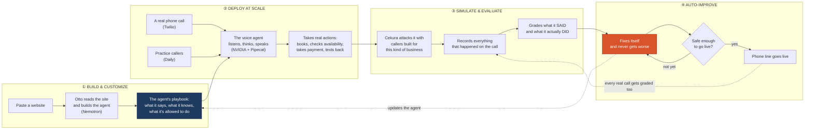
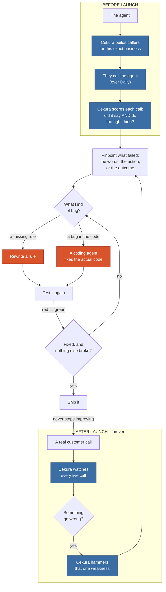
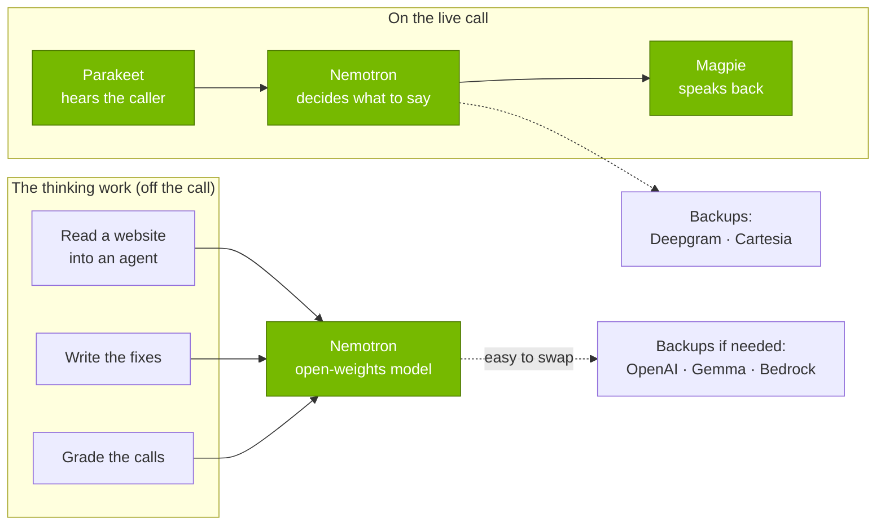

# Otto

**Paste a business website. Get a live, self-healing inbound phone line in 30 seconds.**

> We're not selling a voice agent. We're selling **confidence that a business can safely let
> AI answer the phone.** The hosts put it best: *"we're not looking for the best-sounding
> voice — we're looking for the best **system**."* Otto is the system.

Built at the **Voice Agents Hackathon** (YC SF, May 30 2026), co-hosted by **Daily** and
**Cekura** with **NVIDIA**, **AWS**, and **Twilio**. It runs the whole four-stage brief —
Build & Customize, Deploy at Scale, Simulate & Evaluate, and **Auto-Improve** — and the last
stage, where the eval results flow back in and make the agent safer, is the actual product.

---

## 1. What is this?

Otto turns a business's website into a phone agent that's been stress-tested before it ever
rings. You paste a URL; we read the site and build the agent — its greeting, what it knows,
the things it can actually *do* (book a table, check availability, take a payment, escalate to
a human), and the rules it has to follow. Then, before that number goes anywhere near a real
customer, we attack it.

```
PRE-LAUNCH   extract(url) → AgentSpec → synthetic swarm attacks it → fails → heals → re-runs → GATE → activate
PRODUCTION   every live call → graded → a detected failure authors its own policy fix
                             → a focused swarm re-verifies (RED → GREEN) → redeploy
```

**Why it matters.** For a local business the phone isn't a support channel, it's the front
door. Most people still reach for it first: nearly 8 in 10 say a call is important when they
need to reach a business, and 55% prefer the phone when it's urgent (TransUnion, 2024).[^transunion]
Those calls are also worth more than anything else — across 60M+ calls, 37% of phone leads
close right there on the line, versus under 2% for a web form (Invoca, 2025).[^invoca25] The
problem is nobody's there to pick up. Restaurants are short-staffed — 45% say they don't have
enough people to meet demand (NRA, 2024)[^nra] — so the phone rings while the team is buried.
Roughly a quarter of calls to home-services businesses go unanswered, and almost nobody who
lands in voicemail leaves a message (Invoca, 2024).[^invoca24] A missed call isn't a callback
later; it's a customer who already dialed someone else. One in three businesses say they've
lost money simply because they couldn't get to the phone (Hiya, 2025).[^hiya]

So why not just hand the phone to an AI? Because for these businesses a wrong answer is worse
than a missed one, and AI fails in exactly the way that scares them — it says the wrong thing
with total confidence. Speech-to-text invents words that were never spoken in about 1% of
transcriptions, and roughly 40% of those fabrications are actively harmful (ACM FAccT, 2024);[^whisper]
models quietly degrade over time in 91% of cases (Nature, 2022);[^aging] and about 95% of
enterprise GenAI shows no measurable impact on the bottom line (MIT, 2025).[^mit] The hard part
was never making the voice sound good. It's earning enough trust to turn it on — and that's
only possible when the job is narrow enough to test every way it can go wrong. A single
restaurant's phone calls are exactly that narrow. That's the bet Otto makes.

Here's the failure everyone else misses. Picture a call where the agent sounds flawless — warm,
quick, natural — and then quietly never books the table. The transcript reads perfectly; the
customer shows up to no reservation. Otto grades what the agent *did*, not just what it said. It
reads the whole call as an event stream across four dimensions — what it **said**, what it
**did**, the **end state**, and how it **felt** — with 14 mostly-deterministic detectors, and
every failure it finds writes its own fix. ([`docs/FAILURE_TAXONOMY.md`](docs/FAILURE_TAXONOMY.md).)

---

## 2. Demo video (< 60s)

▶️ **[watch the 60-second demo](ADD_VIDEO_LINK_HERE)**

> *Build a phone agent from a URL → a synthetic swarm attacks it and it goes red → it rewrites
> its own policy and the pass rate jumps to green → the number goes live → we call it and ask
> the exact thing it failed a minute ago, and now it handles it. Loop closed, on camera.*

---

## 3. How we used Cekura, Nemotron, and Pipecat

Here's the whole system on one page — four phases, a single agent brain reached through one
Pipecat pipeline by two different transports, and a feedback edge that drops every live call
back into evaluation:



### Cekura — the evaluation engine behind the whole loop

Cekura is what lets us *say* an agent is safe instead of just hoping it is, and we use it for
both halves of the loop.

Before launch, we hand Cekura the business we just extracted and let it generate the right
callers for that business — allergy questions and big-party bookings for a restaurant,
emergency-dispatch and licensing calls for a contractor. Our personas, mock tools, and
pass/fail criteria map straight onto Cekura's test profiles and metrics, and its simulated
callers dial into the very same Daily room our live agent answers on. So we're never testing a
mock; we're testing the exact pipeline that will pick up the phone.

After launch, Cekura keeps scoring every real call. The moment one regresses, that failure
becomes a fresh, focused swarm aimed at exactly that weakness — fix it, re-run, ship it. Same
engine on both sides.

The part that matters most is that Cekura grades *actions*, not just words. Its
tool-call-accuracy and outcome metrics, together with our own event-stream taxonomy, check
whether the agent actually called `check_availability`, whether the tool came back clean, and
whether the booking really landed. That's how we catch the failure nobody else does — the one
where the agent sounds perfect and the table was never booked.

And when we find a failure, we can fix it two ways. Most of the time the problem is a missing
or sloppy rule, so Otto rewrites a policy. But sometimes the bug is in the tool *code* itself —
a `reserve_table` that can double-book, or a path that lets a card number get written into a
record. Those don't get a policy band-aid; they go to a coding agent that writes a real code
patch, proves it by replaying the call's tool calls through the fixed code, and ships only if
the failure flips from red to green without breaking anything else. It's sandboxed so it can
only touch the tool layer, it can't fake its way past the check, and it starts on a cheap model
and escalates only if it has to. One eval signal, two kinds of self-healing — one for the
agent's rules, one for its code.

Cekura (blue) is the engine for both loops; a failure routes to either a policy fix or a
code-gen fix (orange), and both have to clear the regression gate:



**How much it actually improves.** In a single heal round, with nothing hardcoded, the
restaurant agent went from 50% to 100% (6 of 12 callers passing, then all 12), and the
contractor went from 62% to 100% on its own set of failures. It also can't cheat its way there:
in that same run it proposed four policy changes and threw one out because it would have broken
a test that was already passing. The score only moves in one direction.

> *Honest scope:* those numbers come from our eval loop in `SWARM_MODE=local` (the deterministic
> version of the same loop Cekura drives when `SWARM_MODE=cekura`). We didn't separately record
> an end-to-end pass rate from the live Cekura audio swarm.

### Nemotron (NVIDIA) — open weights doing the real work

The brief asked for open-weights models doing real inference, not just speech, so that's
exactly where we put Nemotron. It's the brain for everything that happens off the call: reading
a website into a spec, writing the policy fixes, and judging how a call went all run on an
open-weights Nemotron through NIM. Because NIM speaks the OpenAI API, switching to it was a
one-line change. On the call itself the whole voice path is NVIDIA too — Parakeet listening,
Nemotron thinking, Magpie speaking — with Deepgram and Cartesia wired up as one-flag fallbacks
so a bad moment on any single piece never takes the demo down. It's essentially Daily and
NVIDIA's own Nemotron voice stack, and we just dropped our self-healing loop on top of it. One
free `nvapi-` key runs all three.



### Pipecat — why "tested" and "live" are the same thing

The agent's brain is a single thing compiled from the spec, and Pipecat is what lets us reach
it two ways: a real call comes in over Twilio, the synthetic swarm comes in over a Daily room,
and both run through the identical pipeline. That one detail is the whole trick — it means a
fix the swarm proves out is *literally* the code that answers the phone, not a close
approximation of it. We lean on Pipecat for the swappable transports, the function-calling that
powers the agent's tools, and the turn-and-interruption handling that makes the "interrupter"
caller a real test instead of a script. There's also an AWS Nova Sonic speech-to-speech path in
there as an alternative to the usual listen-think-speak chain. ([`docs/TECH.md`](docs/TECH.md).)

---

## 4. What we built during the hackathon

All of it. The repo's first commit is 9:04am on May 30 (it started life as "LineForge" and got
renamed to Otto a couple hours in), and everything below was written on the day:

- the AgentSpec contract and the website-to-spec extractor (full-site crawl plus structured-data signals);
- the self-improvement loop itself — swarm, failure detection, policy writing, the regression
  guard that makes healing provably safe, and the launch gate;
- the failure taxonomy: the four-dimension, 14-detector engine that reads a whole call as an
  event stream (including voice/paralinguistic signals) and catches the said-vs-did failures a
  transcript would miss;
- the production loop, where a single live failure spins up a batch of targeted variations —
  different accents, background noise, an angry caller — to confirm and harden the fix;
- the coding-agent healer for bugs that live in code rather than in rules;
- the live Pipecat voice agent on NVIDIA (with Nova Sonic and Gemini/Deepgram/Cartesia
  fallbacks), the Cekura client, six business verticals, a real stateful backend that tracks
  inventory and catches double-bookings, live Twilio SMS, the streaming dashboard, a printable
  safety certificate, deploy paths for Render / Pipecat Cloud / AWS AgentCore, and a 50-test
  suite that passes with no keys at all.

What we *didn't* build is the infrastructure underneath. Pipecat, Cekura, the NVIDIA models on
NIM, and Twilio are all theirs, and the Parakeet streaming-STT service is vendored straight from
the hackathon starter (we just added a shim to bridge a Pipecat version gap). Daily and NVIDIA's
Nemotron voice stack was our starting point.

---

## 5. Feedback on the tools

> *Note to the team: this is drafted from how the build actually went — tighten it to your own
> experience and drop in any real bugs you hit. Cekura specifically asked about bugs, and
> there's a prize for the best feedback.*

**NVIDIA Nemotron.** The best part was how little friction there was. Because NIM is
OpenAI-compatible, pointing our entire reasoning layer at Nemotron was a one-line change, and
the bigger model held up well on the structured work we threw at it — turning a messy website
into a clean spec, writing coherent policy patches. The rough edge is latency on the live call:
the larger open models are just too slow for a natural back-and-forth, so we ended up running a
smaller, faster Nemotron on the call and saving the big one for the off-call reasoning. Clearer
guidance on which Nemotron to reach for when — fast-for-voice versus heavy-for-reasoning —
would've saved us time, and rock-solid JSON output would help anyone whose loop depends on
parsing the model's answers, like ours does.

**Cekura.** Running one engine for both pre-launch testing and live monitoring is exactly the
shape a self-improving product wants, and the scenario generation plus judge metrics dropped
right into our loop. Where it got awkward was managing scenarios over time: re-running the same
fix against a bunch of mutated variations piled up scenarios fast, so we built our own caching
and a manual persona-to-scenario mapping to keep it sane. First-class scenario templates, or a
way to create-or-reuse by key, would make building loops like ours a lot cleaner. *(Drop any
actual API bugs you ran into here.)*

**Pipecat.** The swappable transports are the entire reason our "test it and ship the same
thing" pitch is true, and they came essentially for free — that's a big deal. Function-calling
and interruption handling were solid out of the box. The one thing that bit us was the API churn
between 0.0.x and 1.x; we pinned to `<1.0` and had to vendor the Parakeet service with a
compatibility shim. A clearer migration path would help.

---

## 6. Live link

🔗 **https://otto-orchestrator.onrender.com** — paste a business website and watch the loop run.

> *Verify this is actually deployed and reachable before submitting; if not, swap in the right
> URL or just drop this section (it's optional).*

---

## Run it yourself (zero keys)

```bash
cp .env.example .env          # works with ZERO keys
./scripts/dev.sh              # → http://localhost:8000  (dashboard + API)

# prove the entire loop, no server, no keys:
cd apps/orchestrator && uv run --python 3.12 python scripts/smoke.py

# the test suite:
cd apps/orchestrator && PYTHONPATH=. uv run --python 3.12 --with pytest pytest -q   # 50 passed
```

With no key at all, a deterministic policy-coverage check stands in for the LLM. One free key —
open-weights Gemma on Gemini's free tier, or an NVIDIA NIM key for Nemotron — makes extraction,
the conversation sims, and the live call all real, at $0. Deeper dives live in
[`docs/ARCHITECTURE.md`](docs/ARCHITECTURE.md), [`docs/TECH.md`](docs/TECH.md),
[`docs/FAILURE_TAXONOMY.md`](docs/FAILURE_TAXONOMY.md), and [`docs/DEPLOY.md`](docs/DEPLOY.md).

---

[^transunion]: TransUnion, "The Call Conundrum," Oct 2024 — survey of 1,556 U.S. adults — [source](https://newsroom.transunion.com/nearly-80-of-consumers-consider-phone-channel-important-for-communicating-with-businesses-despite-reluctance-to-answer-calls/).
[^invoca25]: Invoca, *Call Conversion Industry Benchmarks Report 2025* — AI analysis of 60M+ calls; 37% of phone leads convert on the call (web-form ~1.7% is the derived contrast) — [source](https://www.invoca.com/reports/the-invoca-call-conversion-industry-benchmarks-report-2025).
[^nra]: National Restaurant Association, *2024 State of the Restaurant Industry* — [source](https://restaurant.org/research-and-media/media/press-releases/restaurant-industry-sales-forecast-to-set-1-1-trillion-record-in-2024/).
[^invoca24]: Invoca, first-party call-tracking data, 2024 — [source](https://www.invoca.com/blog/how-much-missed-sales-calls-cost-home-services-businesses).
[^hiya]: Hiya, *2025 State of the Call* (survey of ~1,800 working professionals) — [source](https://www.businesswire.com/news/home/20250930624483/en/).
[^whisper]: Koenecke et al., "Careless Whisper: Speech-to-Text Hallucination Harms," ACM FAccT 2024 — [coverage](https://www.science.org/content/article/ai-transcription-tools-hallucinate-too).
[^aging]: Vela et al., "Temporal quality degradation in AI models," *Scientific Reports* (Nature), 2022 — degradation in 91% of 128 (model, dataset) experimental cases — [source](https://www.nature.com/articles/s41598-022-15245-z).
[^mit]: MIT NANDA, *The GenAI Divide: State of AI in Business 2025* — ~95% of organizations saw no measurable P&L impact from GenAI — [coverage](https://fortune.com/2025/08/18/mit-report-95-percent-generative-ai-pilots-at-companies-failing-cfo/).
